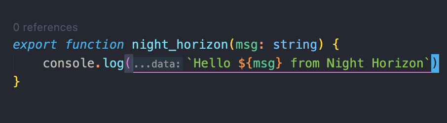

Here's a sample `README.md` for your "Night Horizon" theme with a focus on its blue color palette:

---

# Night Horizon - VS Code Theme

**Night Horizon** is a clean, elegant VS Code theme with a **blue-dominant** color palette, designed to provide a calming, distraction-free coding environment. This theme is perfect for developers who enjoy working in a cool-toned atmosphere, optimizing both aesthetics and readability.

## 🌟 Key Features

- **Blue-Centric Palette:** The theme revolves around varying shades of blue, creating a soothing coding environment without sacrificing clarity.
- **Low-Contrast Background:** A dark background that complements the blue tones, reducing eye strain and improving focus during long coding sessions.
- **Clear Syntax Highlighting:** Carefully designed colors for keywords, strings, comments, and functions, making the code more readable.
- **Consistent Design:** Uniform and balanced color schemes across different file types (JavaScript, TypeScript, HTML, CSS, etc.).
- **Minimal Distractions:** The soft blue palette helps in keeping the interface clean, allowing you to focus on your code.

## 🖌️ Palette Overview

- **Background:** Dark, low-contrast background.
- **Primary Accent:** Deep shades of blue for keywords and core syntax elements.
- **Secondary Accent:** Lighter blues for strings, functions, and methods.
- **Comments:** Soft gray to blend well without taking focus from the code.
- **Errors/Warnings:** Subtle yet noticeable reds and oranges for errors and warnings, ensuring visibility without overwhelming the palette.

## 📸 Screenshots

### TypeScript

## 🔧 Installation

1. Go to the **Extensions** view by clicking on the Extensions icon in the Activity Bar on the side of the window.
2. Search for **"Night Horizon"**.
3. Click **Install** to install the theme.
4. Navigate to **Preferences** > **Color Theme** and choose **Night Horizon**.

## 📝 Customization

Feel free to tweak the theme to your liking:

- Open the command palette (Ctrl+Shift+P) and type **"Preferences: Open Settings (JSON)"**.
- Customize colors by adding specific key-value pairs for different elements.

## 🌐 Feedback & Contributions

We would love to hear your feedback and suggestions! Feel free to report issues or contribute on our [GitHub repository](https://github.com/your-repo/night-horizon-theme).

---

Enjoy coding in **Night Horizon**, where the calm blue tones meet clarity and focus. ✨

---

This `README.md` introduces your theme in a concise yet detailed manner, making it easy for users to understand the features and how to install the theme.
